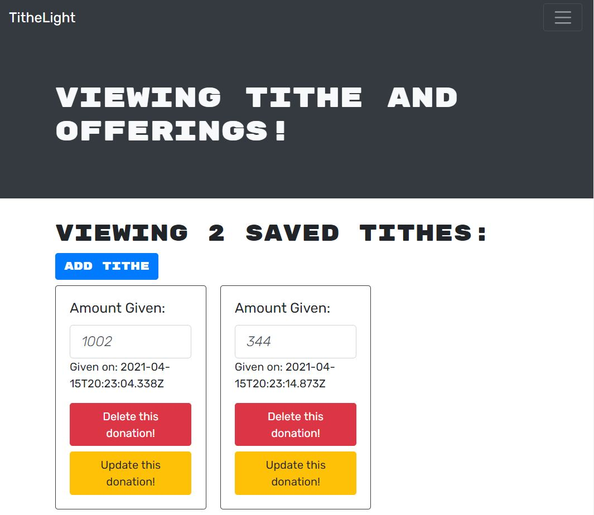

# TitheLight 

## Description
``` This tithing application was developed specifically for The Light SDA Church. The goal was to create an application that members and visitors can use as a means to track all tithing activity throughout the year in a convenient and easy to use format.```

## Technologies
* React
* CSS
* JavaScript
* MongoDB
* Node.js
* Express.js

## Preview



## Links

* [GitHub](https://github.com/brdyherr/tithelight)
* [LinkedIn](https://www.linkedin.com/in/braudy-herrera-5855261a/)
* [Email](brdyherrera@gmail.com)
